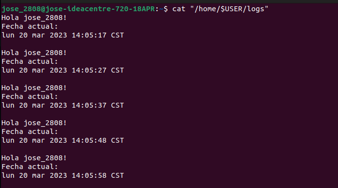

# ACTIVIDAD 4 - EJECUTAR SCRIPT COMO UN SERVICIO SYSTEMD
Primeramente se debe realizar el script que se estará ejecutando
```Bash
    #!/usr/bin/env bash

    #Undefined variables ar treated as errors
    set -o nounset
    #If a part of a pipe fails, then the whole pipe fails
    set -o pipefail

    {
    echo "Hola $USER!"
    echo "Fecha actual:" 
    date
    echo ""
    } >> "/home/$USER/logs"
```
Posteriormente se deberá hacer que el script sea un ejecutable.

```Bash
    chmod +x script.sh
```

Después de esto se deberá crear un servicio para poder hacer funcionar el script, para esto se creará un archivo en la ruta **/etc/systemd/system/** el cual puede tener cualquier nombre, en este caso será **actividad4**.

```Bash
    sudo touch /etc/systemd/system/actividad4.service
```

Despues de esos se deberá crear un apartado dentro del archivo **.service** creado que llevará por encabezado **[Unit]**, dentro de este encabezado solamente irá una descripción de lo que realiza el servicio.

Posteriormente se deberá realizar otro encabezado que llevará por nombre **[Service]**, en donde se deberá indicar el tipo de servicio (que en este caso será **simple**), en **Restart** se deberá indicar en que ocasiones se desea que el servicio se esté reiniciando por lo que en este caso se pondrá que se desea reiniciar siempre, es decir, constantemente, en **RestartSec** se deberá indicar el número de segundos que el sistema deberá esperar antes de intentar el reinicio del servicio, en este caso se indicó un lapso de 10 segundos, finalmente en **User** se deberá indicar el usuario actual y en **ExecStart** se deberá indicar la ruta del script a ejecutar.

El encabezado **[Install]** se usa para poder definir diferentes niveles objetivo en el sistema, en este caso el contenido de este encabezado será **WantedBy=multi-user.target**.

Nuestro servicio, al finalizar esto deberá quedar de la siguiente forma:

```
    [Unit]
    Description=Actividad 4 Sistemas Operativos

    [Service]
    Type=simple
    Restart=always
    RestartSec=10
    User=jose_2808
    ExecStart=/home/jose_2808/Documentos/Sistemas_Operativos_1/so1_actividades_202004804/actividad4/script.sh

    [Install]
    WantedBy=multi-user.target
```

Se deberán guardar los cambios y, posteriormente para poder hacer funcionar nuestro servicio se deberá ejecutar el siguiente comando:

```Bash
    systemctl start actividad4.service
```
Al revisar el archivo al cual estamos escribiendo la salida de nuestro servicio se puede ver que, efectivamente, nuestro servicio está en funcionamiento y se está reiniciando cada 10 segundos.



Para poder detener el servicio se deberá ejecutar el siguiente comando:

```Bash
    systemctl stop actividad4.service
```

